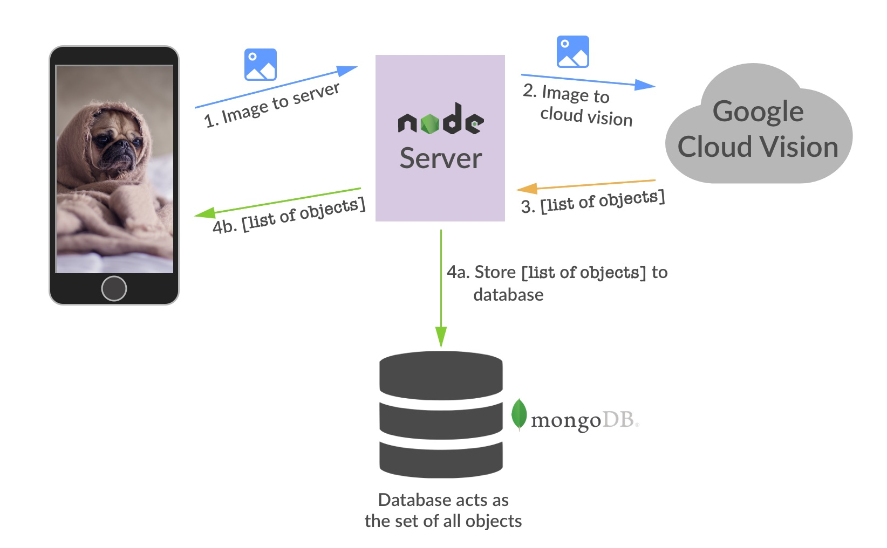
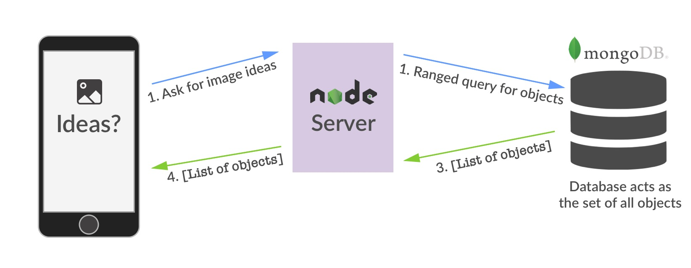

# Photo Ideas App

Photo Ideas is a computer vision powered iOS app that gives you crowed sourced photo ideas.

#### _Computer vision powered?_
Photos are passed through the Photo Ideas backend which acts as a image processing pipeline.
Photo Ideas backend uses Google's Cloud Vision API for object recognition.

#### _Crowd sourced photo ideas?_
After objects are recognized in the Photo Ideas pipeline they are saved to a database which acts as a set of all objects recognized. When photo ideas are requested they are fetched from this 'set of all objects' database.

